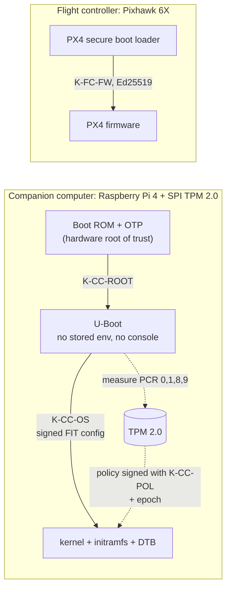

# P2: Verified boot chain for a notional small UAS

[](https://github.com/samyoon727ca/uas-sec-p2-verified-boot/actions/workflows/validate.yml)

This repo produces the verification evidence for three requirements that the [P1 security architecture](https://github.com/samyoon727ca/uas-sec-p1-architecture) assigns to P2:
- the companion computer (CC) boots only a signed chain, verified from a hardware root of trust (SR-005);
- the CC's keys are sealed to its TPM and released only to the measured boot state (SR-010);
- the PX4 flight controller (FC) boots only signed firmware (SR-018).

Each step traces back to P1's threats and verification events.

> **Notional and unclassified.** Built only from public sources: U-Boot, PX4, Raspberry Pi, TCG, tpm2-software and NIST documentation and source. It is not based on any real program or system. Assumptions are labeled as assumptions. All keys are dev/test keys; no private key is committed.

**Status: design baselined; evidence not yet produced.** Nothing below is called working until its test case passes. The evidence table at the end is generated from the data and shows what has passed.

## Threat

P2's three parent requirements answer nine P1 threats, eight of them rated MI-1 (P1 snapshot at `7aadc83`):

| Threat | Impact | Answered by |
|---|---|---|
| THR-010 Code execution on the CC yields full vehicle C2 | MI-1 | SR-005 (with P3 and P4 controls) |
| THR-008 Persistent modification of CC software; THR-032 CC storage rewritten offline | MI-1 | SR-005 |
| THR-034 Keys extracted from a captured CC; THR-035 CC trust anchors replaced | MI-1 | SR-010 |
| THR-007 Vehicle impersonated with a stolen CC WireGuard key | MI-2 | SR-010 |
| THR-030 FC firmware modified through the boot loader; THR-041 release artifacts tampered before loading; THR-058 unsigned firmware loaded over USB | MI-1 | SR-018 |

## Requirements

| P1 requirement | P2 refinement | Verified by |
|---|---|---|
| **SR-005** CC boots only boot-chain components signed with the project boot key, verified from a hardware root of trust | SR-005.1: boot-loader configuration comes only from the verified image and signed FIT configurations | VE-07 |
| **SR-010** CC seals its WireGuard key and signing key to its TPM, bound to the measured boot state | SR-010.1: PCRs 0, 1, 8, 9 · SR-010.2: MSS-signed policy · SR-010.3: anti-rollback epoch · SR-010.4: encrypted unseal | VE-07 |
| **SR-018** FC boots only firmware signed with the project firmware key (PX4 Bootloader Secure Boot) | None needed; two P1 gaps proposed instead | VE-08 |

Child requirements keep their parent's component and method, and trace only to their parent's P1 threats. Anything new goes to P1 as a proposed change ([§1](docs/01-scope-and-trace.md)).

## Design



- **Verified boot (SR-005).** Two stages ([§2](docs/02-cc-boot-chain.md)). The Pi's boot ROM checks Raspberry Pi's signed `bootsys` firmware, which checks `boot.img` against a key whose hash is burned into OTP. So U-Boot itself is verified from hardware. U-Boot then accepts only a FIT configuration signed with K-CC-OS that covers the kernel, initramfs and devicetree. It reads no environment from storage, offers no console and boots no legacy images.
- **Measured boot and sealing (SR-010).** U-Boot extends PCRs 0, 1, 8 and 9 before running anything ([§3](docs/03-measured-boot-sealing.md)). The keys are sealed once to `TPM2_PolicyAuthorize`. Each release ships an MSS-signed policy for its predicted PCRs, so updates need no re-sealing.
- **Anti-rollback.** Neither U-Boot nor the Pi provides it, so it is enforced at key release: an NV bit-field epoch in the policy denies keys to an older signed chain.
- **FC (SR-018).** PX4 Bootloader Secure Boot at `v1.18.0-rc1`: Ed25519 via monocypher, with an offline recovery key in a second slot ([§4](docs/04-fc-secure-boot.md)). PX4 has no firmware anti-rollback; that is proposed to P1 as a new threat.
- **Keys.** Five signing keys, all dev keys in P2, with a documented hand-off to P3's offline root and HSM tiers ([§5](docs/05-key-management.md)). The Pi fixes the root key at RSA-2048. That is 112-bit strength, which NIST SP 800-57 disallows for new signatures from 2031; it is recorded as a residual risk.

## Verification evidence

CI runs QEMU `virt` with U-Boot and swtpm. It proves the boot-loader configuration, the tamper cases, the measurements and the sealing policy. Only hardware proves the root of trust, a real TPM, and PX4's check at reset ([§6](docs/06-verification.md)). An event passes only when all its CI and hardware runs pass; then a P1 pull request records it.

<!-- BEGIN GENERATED: ve-status -->
| Event | Verifies (P1) | CI runs passed | Hardware runs passed | P2 status | P1 status |
|---|---|---|---|---|---|
| VE-07 CC verified boot and key sealing | SR-005, SR-010 | 0 of 9 | 0 of 9 | planned | planned |
| VE-08 FC boots only signed firmware | SR-018 | 0 of 1 | 0 of 3 | planned | planned |
<!-- END GENERATED: ve-status -->

Traceability is checked on every push. [`tools/validate_trace.py`](tools/validate_trace.py) fails the build if any of these hold:
- a child requirement doesn't refine a P2 parent, or changes its component or method;
- a child traces to a threat that P1 doesn't link to its parent;
- a test case cites a requirement its verification event doesn't cover;
- a passed or failed result has no evidence;
- a requirement or event is left without a test case.

[`tools/check_p1_snapshot.py`](tools/check_p1_snapshot.py) confirms the P1 snapshot matches P1 at the pinned commit. [`tools/check_no_secrets.py`](tools/check_no_secrets.py) fails on any private key in the tree.

## Repository map

| Path | Contents | Status |
|---|---|---|
| [`docs/01-scope-and-trace.md`](docs/01-scope-and-trace.md) | P1 parents, child requirements, assumptions `A2-##`, changes proposed to P1 | Baselined |
| [`docs/02-cc-boot-chain.md`](docs/02-cc-boot-chain.md) | Hardware choice, stages, boot-loader configuration, emulated chain, anti-rollback | Baselined |
| [`docs/03-measured-boot-sealing.md`](docs/03-measured-boot-sealing.md) | PCRs, sealed objects, signed policies, epoch, update flow, session protection | Baselined |
| [`docs/04-fc-secure-boot.md`](docs/04-fc-secure-boot.md) | PX4 secure boot facts, workflow, recovery, gaps | Baselined |
| [`docs/05-key-management.md`](docs/05-key-management.md) | Key table, dev-key rules, hand-off to P3 | Baselined |
| [`docs/06-verification.md`](docs/06-verification.md) | Test cases, what emulation and hardware each prove, evidence rules | Baselined |
| [`docs/references.md`](docs/references.md) | Sources and tools, with pinned versions | Baselined |
| [`data/`](data/) | Child requirements, trace and test cases (CSV); pinned P1 snapshot | Populated |
| [`cc/`](cc/) | Pinned U-Boot release and P2 configuration, host and guest package pins, build script for the emulated chain | Built |
| [`tests/ve07/`](tests/ve07/) | VE-07 emulated harness: QEMU `virt` + U-Boot + swtpm, with control runs on stock U-Boot | TC-01, TC-03, TC-04 built |
| [`evidence/`](evidence/) | Captured logs and summaries, one folder per run | Populated |
| `fc/`, `tests/ve08/` | PX4 secure-boot build, signing and host checks | Planned |

## Run the checks locally

```sh
python -m unittest discover -s tests
python tools/validate_trace.py
python tools/render_views.py --check
python tools/check_no_secrets.py
python tools/check_p1_snapshot.py   # needs network
```

Python 3.11+. Standard library only.

The emulated VE-07 run needs Ubuntu 24.04 ([`tests/ve07/README.md`](tests/ve07/README.md)):

```sh
cc/emu/install-host-packages.sh   # pinned packages from the Ubuntu snapshot
cc/build.sh                       # about 2 minutes on 4 cores
python3 tests/ve07/boot_cases.py --build build --out /tmp/ve07
```

## License

[Apache-2.0](LICENSE)
