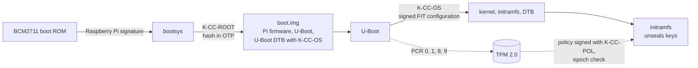

# 2. CC boot chain

The CC verifies its boot chain in two stages. First, the SoC's boot loader verifies `boot.img`, which holds U-Boot, against a key whose hash is burned into one-time-programmable (OTP) memory: the hardware root of trust for SR-005. Then U-Boot verifies a signed FIT configuration that covers the kernel, initramfs and devicetree. U-Boot takes no configuration from storage or the console (SR-005.1). Each stage that runs code also measures it into the TPM (§3).

Status: design. Nothing here is shown working until its test case passes ([§6](06-verification.md)).

## 2.1 Hardware target

| | Raspberry Pi 4 + SPI TPM | Raspberry Pi 5 + SPI TPM | NXP i.MX 8M EVK + SPI TPM |
|---|---|---|---|
| Root of trust | ROM checks Raspberry Pi's signature on `bootsys`; `bootsys` checks the customer key against an OTP hash; `boot.img` is verified with RSA-2048 [RPI-SB] | As Pi 4, and the ROM also requires a customer counter-signature on `bootsys` [RPI-SB] | ROM (HAB) verifies SPL and U-Boot against a fused key hash |
| U-Boot reaches the TPM | Only through GPIO soft SPI (`spi-gpio`). No BCM2711 SPI driver in U-Boot `v2026.07` [UBOOT]. Not yet shown (OI2-01) | No. The header pins are behind RP1, and U-Boot has no RP1 driver [UBOOT] | Native SPI driver |
| Irreversible step | Programming the OTP key hash | Programming the OTP key hash | Burning fuses |

**Choice (DD2-01): Raspberry Pi 4.** The Pi 5 cannot measure the boot before Linux runs, which undercuts SR-010. The i.MX 8M is the highest-fidelity option, at higher cost.

**Why the TPM, not Pi OTP, holds the keys:** Raspberry Pi notes that any code running in supervisor mode can read an OTP-held key directly [RPI-SB]. A TPM releases a key only to the measured state.

## 2.2 Stages

| Stage | Verified by | Key | Measured into |
|---|---|---|---|
| `bootsys` (Raspberry Pi firmware) | Boot ROM | Raspberry Pi's key | — (the Pi does not measure) |
| `boot.img`: GPU firmware, `config.txt`, U-Boot, U-Boot control devicetree | `bootsys` | K-CC-ROOT, RSA-2048; hash in OTP | — |
| Signed FIT: kernel, initramfs, devicetree | U-Boot | K-CC-OS, RSA-3072 with SHA-256, required for every configuration | PCR 0 (U-Boot version), PCR 1 (devicetree, kernel command line), PCR 8 (kernel), PCR 9 (initramfs) |
| Root filesystem | Kernel (dm-verity) | P4 (SR-006) | — |

**One signature over everything.** U-Boot verifies the signed *configuration*, which lists every image it uses (`sign-images = "kernel", "fdt", "ramdisk"`). Signing images one by one would let an attacker pair signed images that were never released together [UBOOT-SIG] (DD2-04).

## 2.3 Boot-loader configuration (SR-005.1)

"Boot configuration" in VE-07 means everything that decides what U-Boot boots: its environment, its console and the FIT configuration it picks. All of it either lives inside the verified boot-loader image or is covered by the FIT signature.

| U-Boot setting | Value | Why |
|---|---|---|
| `FIT_SIGNATURE` | on; key marked *required* in the control devicetree | Unsigned or wrongly signed configurations are refused |
| `LEGACY_IMAGE_FORMAT` | **off** | Legacy uImages carry no signature. `qemu_arm64_defconfig` turns them on, so the fragment must turn them off [UBOOT] |
| `ENV_IS_NOWHERE` | on | The environment is compiled into the verified image; nothing is read from flash or disk |
| `BOOTDELAY` | `-2` | Autoboot with no check for a keypress [UBOOT] |
| `BOOTSTD_BOOTCOMMAND` | off | Standard boot would scan disks for scripts and `extlinux.conf`, which are not signed |
| `BOOTCOMMAND` | Read a fixed-size raw FIT slot, `bootm` it, then `reset` | Nothing reaches a prompt: any failure resets. No filesystem is parsed before the signature check (DD2-05) |
| `MEASURED_BOOT` | on | §3 |

The exact fragment and a check of the built `.config` land with the emulated test harness (TC-04).

## 2.4 Emulated chain

CI runs the same U-Boot configuration on QEMU's `virt` machine with swtpm. The differences are deliberate and are listed so that evidence is read correctly.

| | Hardware (Pi 4) | Emulated (QEMU `virt`) |
|---|---|---|
| Root of trust | ROM + OTP verify `boot.img` | None. QEMU loads `u-boot.bin`, trusted by assumption (A2-03) |
| Where K-CC-OS lives | U-Boot control devicetree inside the signed `boot.img` | U-Boot control devicetree passed by QEMU with `-dtb`. U-Boot on QEMU takes its devicetree from the prior stage and refuses `OF_SEPARATE` [UBOOT], [UBOOT-QEMU] |
| TPM | SPI TPM through `spi-gpio` | swtpm through `tpm-tis-device` and U-Boot's `TPM2_MMIO` [QEMU] |
| FIT storage | Raw partition on the SD card | Raw virtio disk |
| Devicetree | Pi devicetree | Dumped from QEMU with the *same* command line used to boot. A dump taken without `-bios` crashed the kernel during AMBA probing in a prototype run |

## 2.5 Anti-rollback

Neither stage provides it. U-Boot `v2026.07` has no FIT anti-rollback option [UBOOT], and the Raspberry Pi documentation describes none for `boot.img` [RPI-SB].

P2 enforces anti-rollback at **key release**: an older signed chain may boot, but cannot unseal the keys (SR-010.3, §3.4). Without the WireGuard key it cannot reach the GCS. Without the MAVLink signing key the FC rejects everything it sends. So a rolled-back CC cannot join C2, and the vehicle falls back to the data-link-loss failsafe (P1 DD-05).

Refusing to *boot* an older chain would need a U-Boot patch that reads the TPM epoch through `tpm2_nv_read_value` and compares it with a signed FIT property. U-Boot's `tpm2` shell command cannot read NV [UBOOT]. That option (SR-005.2) was considered and not adopted (DD2-07).

## 2.6 Design decisions

| ID | Decision | Rationale | Alternative considered |
|---|---|---|---|
| DD2-01 | CC hardware: Raspberry Pi 4 with an SPI TPM 2.0 module | §2.1 | Pi 5 (U-Boot cannot reach the TPM); i.MX 8M (higher fidelity, higher cost) |
| DD2-02 | Two verification stages: Pi signed boot (K-CC-ROOT) then U-Boot FIT (K-CC-OS) | The OTP key can never change. Keeping it for the rarely changed U-Boot bundle lets K-CC-OS rotate with a new `boot.img` | Kernel and initramfs directly in `boot.img` with no U-Boot: simpler, but then nothing measures the kernel before it runs |
| DD2-03 | U-Boot takes no configuration from storage or the console (§2.3) | SR-005.1 | Signed boot scripts: more moving parts |
| DD2-04 | Sign configurations, covering every image | Prevents mixing images from different releases [UBOOT-SIG] | Per-image signatures |
| DD2-05 | FIT read from a fixed-size raw slot | No filesystem parser runs on attacker-controlled storage before the signature check | Load from FAT or ext4 |
| DD2-06 | CI evidence from QEMU `virt` + swtpm; hardware evidence from the Pi | §2.4, [§6](06-verification.md) | TF-A trusted board boot under QEMU to emulate a root of trust: possible later, not needed for the hardware claim |
| DD2-07 | Anti-rollback at key release (SR-010.3), not at boot | §2.5 | U-Boot patch (SR-005.2) |

## 2.7 Open items

| ID | Item | Closed by |
|---|---|---|
| OI2-01 | U-Boot driving the SPI TPM through `spi-gpio` on the Pi 4 has not been shown (A2-06). Fallback: measure from the verified initramfs, recorded as a deviation from SR-010.1 | First hardware spike |
| OI2-02 | Not yet known whether the Raspberry Pi tools enforce `boot.img` signatures before OTP is programmed. Programming OTP is permanent [RPI-SB] | Check before TC-02; OTP is programmed only with the owner's explicit go-ahead |
| OI2-03 | U-Boot as the `kernel=` inside a secure-boot `boot.img` is not yet shown. Raspberry Pi describes `boot.img` as holding the firmware, the kernel and its dependencies [RPI-SB] | First hardware spike |
